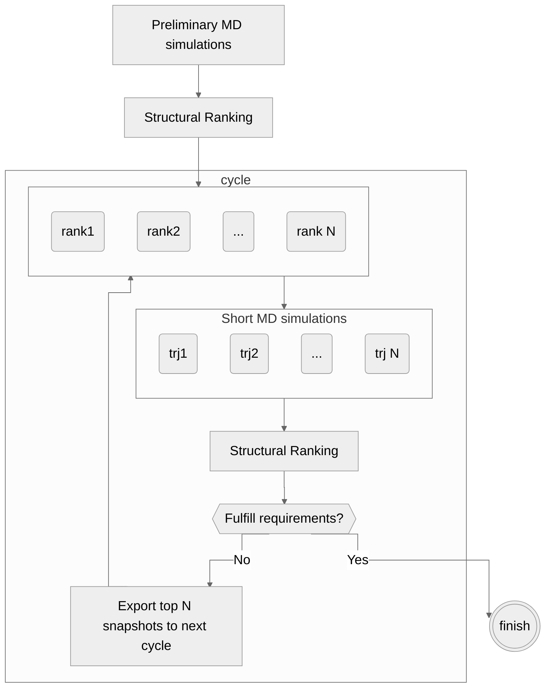

# PaCS-Toolkit User Guide
Welcome to PaCS-Toolkit User Guide. Here, we provide instructions on how to use PaCS-Toolkit. If you encounter any issues and cannot be solved here, please feel free to submit a [Github Issue](https://github.com/Kitaolab/PaCS-Toolkit/issues). We hope PaCS-MD will be helpful for your research.

*Content*
- [What is PaCS-MD ?](#what-is-pacs-md-)
- [Citation](#citation)
- [Access](#access)


## What is PaCS-MD ?
PaCS-MD is an enhancement sampling method that exhaustedly samples the conformational space of given systems. PaCS-MD comprises multiple short MD simulations being cascaded by the selection of the starting structures for the next simulation cycles based on given evaluation criteria. By repeating this process, a large conformational space can be sampled without any mechanistic driven bias.



## Citation
```
```

## Access
- Author
  - [KitaoLab](http://www.kitao.bio.titech.ac.jp/)

~~~txt
# Head
- Kitao

# Team leader
- Ikizawa

# Coding team including documentation
- Ikizawa (lead)
- Hori
- Kono

# Testing team
- Tegar (lead)
- Duy
- Bai
- Kimizono
- Lu
~~~

- Source code
  - [Github](https://github.com/Kitaolab/PaCS-Toolkit)
