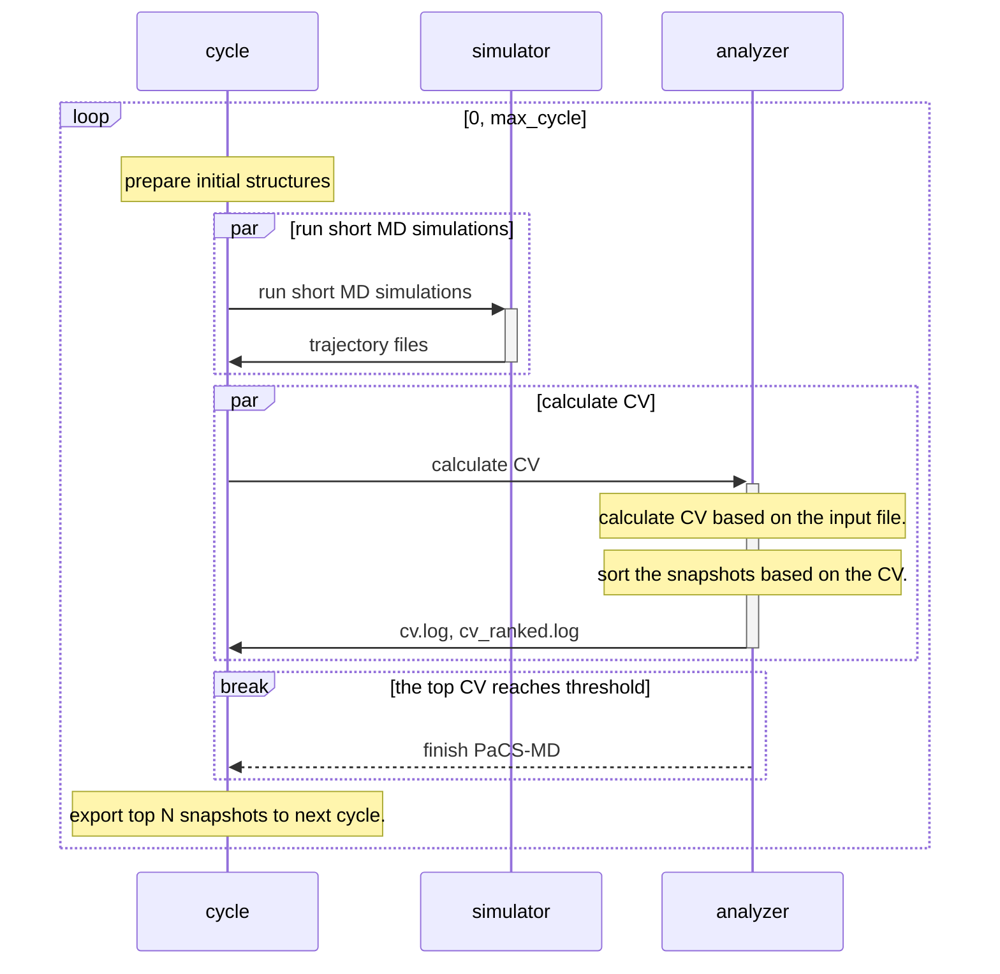

# Overview

### generated files
- mdrun reads the file specified by -f and performs MD calculations according to its contents.
- After the command is executed, the following directory structure is created.

Directory structure of pacsmd:

- tiral001 /
  - cycle000 /
    - replica001 /
      - trajectory file
    - summary /
      - cv.log
      - cv_ranked.log
      - progress.log
  - cycle001 /
    - replica001 /
    - replica002 /
    ...
    - replica `n_replica` /
    - summary /
  - cycle002 /
  ...
  - cycle `max_cycle` /

  

- The directory structure is created as shown above, and the following files are created.
  - `trajectory file`
    - The trajectory file is a file that contains the coordinates of the atoms in the system at each time step.
    - file name without extension is `prd` and the extension is determined by the input file.
  - `cv.log`
    - The cv.log file contains the calculated collective variable (CV) values for each frame in the trajectory file.
    - first column: replica number (1-indexed)
    - second column: frame number (1-indexed)
    - third column: CV value
  - `cv_ranked.log`
    - The cv_ranked.log file contains the sorted CV values.
  - `progress.log`
    - The progress.log file contains the progress of the simulation in each cycle.

### Overall diagram
- PaCS-MD runs multiple short simulations, from which it selects a snapshot that meets its objectives and serves as the initial structure for the next cycle. Therefore, the diagram is as follows.

- Below is an overview of each component. If necessary, see [Reference](reference.md) for more information on each component.
- simulator
  - The simulator performs one short MD on the starting structure in cycle 0.
  - In the other cycles, it executes n_replica short MDs, starting from the top-ranking structure of each cycle.
  - Currently, only GROMACS, AMBER and NAMD are supported.
  - See [Simulator](simulator.md) for more information

- analyzer
  - The analyzer calculates the collective variable (CV) based on the type specified in the input file.
  - The analyzer sorts the structures in each trajectory based on the CV.
  - User-defined types are also available.
  - See [Analyzer](analyzer.md) for more information
  